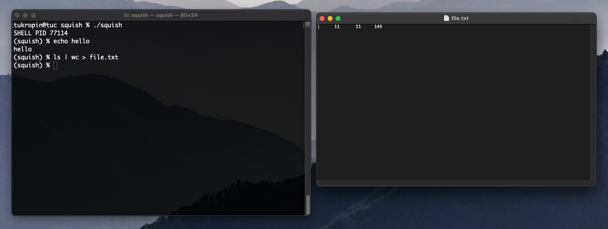

# Shell-Emulator
C program which emulates the commands of a terminal for Linux and MacOS

Project Summary: In this project I made a shell emulator called SQUISH (Superior Quality Unbeatable Interprocess(communication) Shell. This shell uses multi-
threading and interprocess communication to execute shell commands. Some features of this shell are the ability to pipe between multiple procecess in a chain,
and file redirection. 

Tools Used: C, Make

